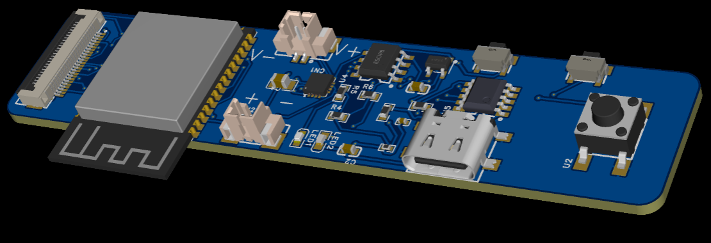
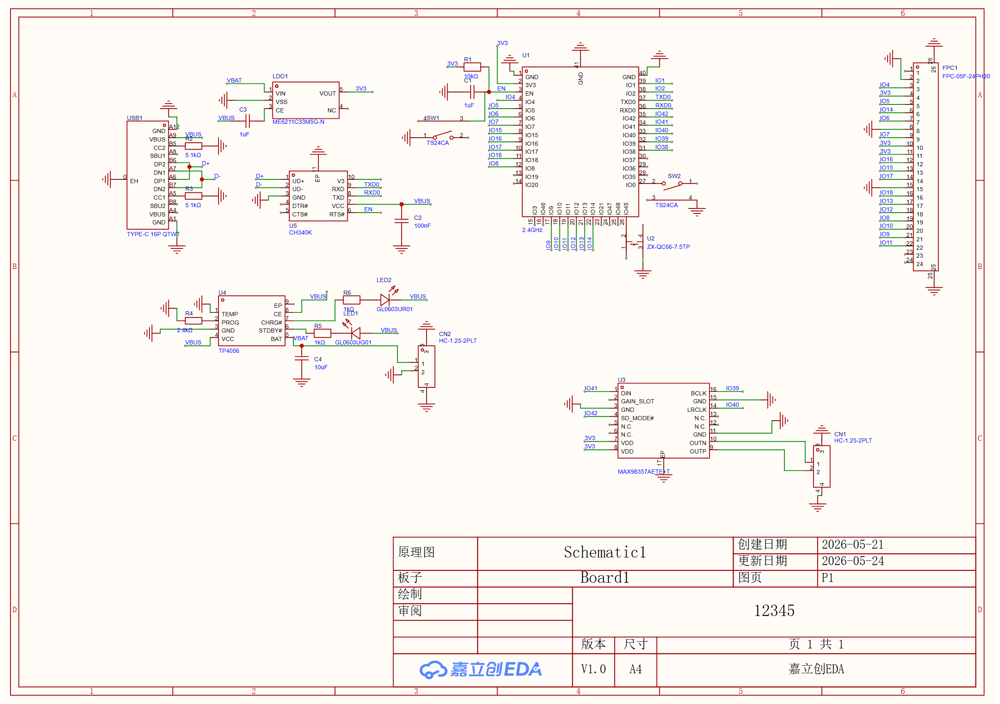
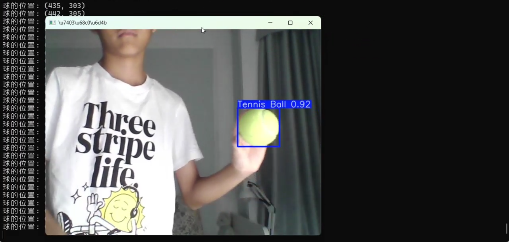

# 肖敬天

**创客 · 嵌入式硬件与三维设计**

`hello@example.com` · `github.com/yourname` · `城市 / City`

> 一名动手型创客，兴趣横跨嵌入式硬件、三维设计与开源软件部署。我喜欢从一块空白的开发板或一个空白的建模窗口开始，把脑子里的想法一步步变成能跑、能摸得到的实物。下面是为这次活动整理的四个代表性项目，涵盖了我在硬件、设计和软件部署上的实践。

---

## 项目 / Projects

### 01 · ESP32 + 小智 AI 嵌入式研究
*Embedded / Firmware · 2024 — 2025*

这个项目以 ESP32 微控制器为核心，搭建了一套带 AI 语音交互能力的嵌入式设备。ESP32 负责底层的硬件控制——包括 Wi-Fi 与蓝牙通信、传感器数据采集、OLED 屏幕显示以及整体的低功耗管理；在此基础上，我接入了 **小智 AI**，让设备具备语音唤醒、语音对话和智能响应的能力。

整个开发过程从最基础的点亮屏幕、读取传感器开始，逐步打通了网络连接、云端通信和 AI 接口调用的完整链路。为了验证硬件和交互的稳定性，我还在 OLED 屏上实现了一个「恐龙快跑」小游戏作为演示，既测试了屏幕刷新和按键响应，也让整台设备看起来更有趣。

这块板子是我**自己设计的**——在嘉立创 EDA 中完成了原理图设计与 PCB 布线，集成了 Type-C 接口、CH340K 串口、TP4056 锂电充电管理、MAX98357 音频功放以及 FPC 排线接口，并在打样前用 3D 模型预览了元件布局与装配效果。

**主要工作：**
- 基于 ESP32 完成硬件选型、电路搭建与固件开发
- 在嘉立创 EDA 中自主设计原理图与 PCB 布线
- 接入小智 AI，实现语音唤醒与智能对话交互
- 打通 Wi-Fi / 蓝牙通信与云端数据传输
- 传感器数据采集与低功耗运行优化
- OLED 屏交互演示（含「恐龙快跑」小游戏）

**技术栈：** `ESP32` `小智 AI` `嘉立创 EDA / PCB 设计` `C / C++` `Wi-Fi / 蓝牙` `传感器` `低功耗`

*ESP32 开发板 V1.3 · OLED 屏运行「恐龙快跑」*

*自主设计 PCB · 嘉立创 EDA 3D 渲染预览*

*原理图 · Type-C / CH340K / TP4056 / MAX98357 / FPC（嘉立创 EDA）*

---

### 02 · 3D 建模与设计
*3D Modeling · 2025*

这个项目我使用 **Fusion 360** 进行三维结构与外观设计，完整走过了从草图、参数化建模、多视角渲染到为 3D 打印做准备的全流程。Fusion 360 的参数化特性让我可以反复调整尺寸和结构而不必从头重做，非常适合需要不断迭代的设计。

在建模过程中，我重点练习了零件之间的装配关系、壁厚与公差控制，以及如何让模型既美观又真正能够打印出来、组装得上。完成建模后，我导出了多个视角的渲染图来检查比例和细节，并针对 3D 打印调整了模型的支撑结构和摆放方向。

**主要工作：**
- 使用 Fusion 360 进行参数化建模与外观设计
- 处理零件装配、壁厚与公差等可制造性细节
- 输出多视角渲染图，检查比例与结构
- 为 3D 打印做模型优化与导出准备

**技术栈：** `Fusion 360` `参数化建模` `渲染` `3D 打印`

 

*Fusion 360 · 多视角建模截图*

---

### 03 · OpenClaw 部署
*Deployment / Open Source · 2025*

这个项目我完成了开源游戏引擎 **OpenClaw** 的完整环境搭建与部署，把它从一份源代码一步步跑成了可以实际运行的游戏。整个过程包括获取源码、配置依赖库、解决编译报错，到最终成功构建并运行。

对我来说，这个项目的价值在于真正理解了一个开源项目「从代码到运行」之间会遇到哪些坑：依赖版本不匹配、编译环境配置、资源文件路径等问题。通过逐个排查和查阅文档、社区 issue，我把这些问题一一解决，也因此对构建工具链和开源协作的流程有了更扎实的认识。

**主要工作：**
- 获取并阅读 OpenClaw 开源项目源码
- 配置编译环境与第三方依赖库
- 排查并解决编译与运行过程中的报错
- 成功构建并运行，验证完整流程

**技术栈：** `OpenClaw` `C++` `编译构建` `环境部署` `开源`

---

### 04 · YOLO 26 + Roboflow 目标检测模型训练
*Machine Learning / Computer Vision · 2025 — 2026*

这个项目我使用 **YOLO 26** 配合 **Roboflow** 完成了一个目标检测模型的训练全流程。Roboflow 负责数据这一端——我在上面完成了图像数据集的上传、标注、数据增强和版本管理，并直接导出成 YOLO 训练所需的格式；YOLO 26 则负责模型这一端，基于标注好的数据集进行训练、验证和推理。

整个过程让我完整体会了一个机器学习项目「从数据到模型」的闭环：先用 Roboflow 把原始图片标注成带边界框的数据集，做必要的数据增强来提升泛化能力，再喂给 YOLO 26 训练，观察损失曲线和精度指标（如 mAP、precision、recall）并反复调参，最后用训练好的模型在新画面上做实时检测。

**主要工作：**
- 在 Roboflow 上完成数据集采集、标注与数据增强
- 管理数据集版本并导出为 YOLO 格式
- 使用 YOLO 26 进行模型训练、验证与调参
- 关注 mAP / precision / recall 等指标优化效果
- 用训练好的模型做实时目标检测并录制演示

**技术栈：** `YOLO 26` `Roboflow` `目标检测` `数据标注` `Python` `计算机视觉`

*YOLO 26 实时检测「Tennis Ball」· 置信度 0.92，终端实时输出坐标*

> 📹 **检测演示视频**：编辑本 README 时，把 `assets/yolo-demo.mp4` 直接拖进 GitHub 网页编辑框，GitHub 会自动生成可在线播放的视频，替换掉这一行即可。

---

*© 2026 肖敬天 · 为活动整理*
