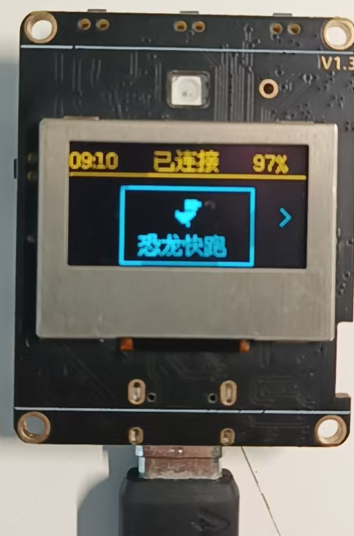
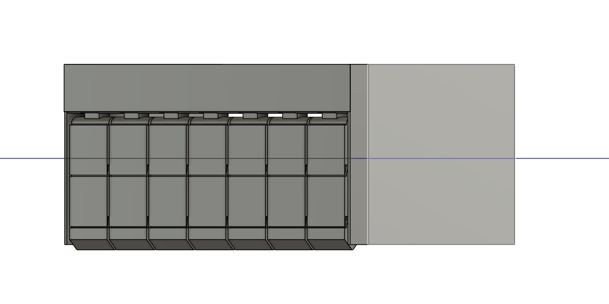
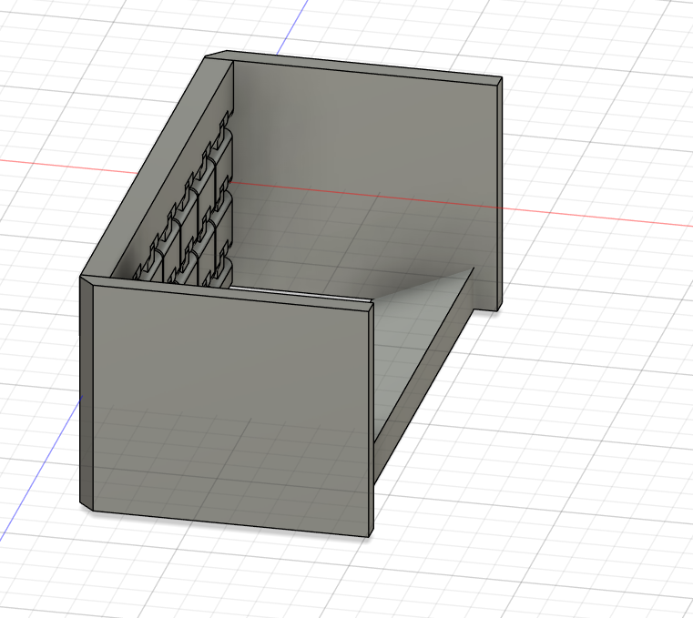
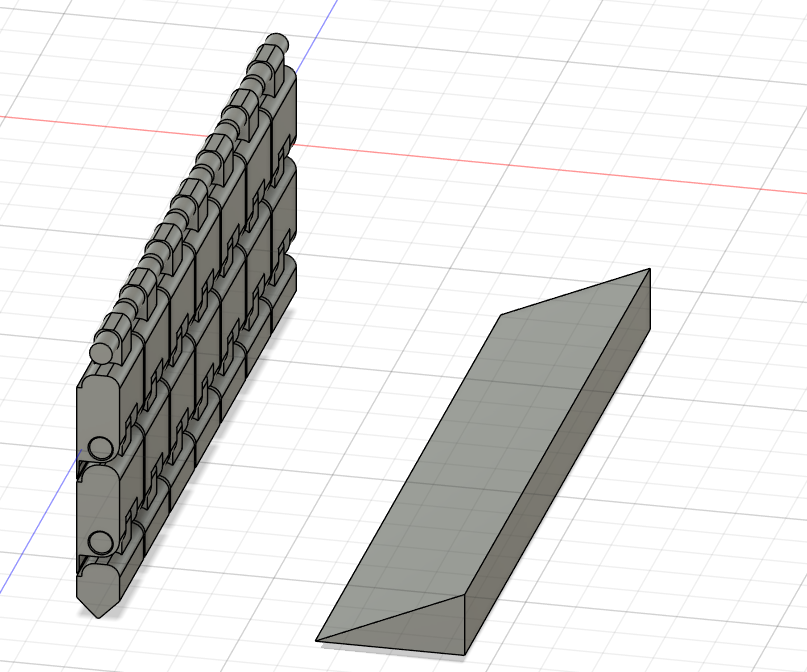

# 你的名字

**创客 · 嵌入式硬件与三维设计**

`hello@example.com` · `github.com/yourname` · `城市 / City`

> 一名动手型创客，兴趣横跨嵌入式硬件、三维设计与开源软件部署。下面是为这次活动整理的三个代表性项目。

---

## 项目 / Projects

### 01 · ESP32 嵌入式研究
*Embedded / Firmware · 2024 — 2025*

围绕 ESP32 微控制器进行的嵌入式开发，涉及 Wi-Fi 与蓝牙通信、传感器数据采集和低功耗设计。在 OLED 屏上实现了「恐龙快跑」小游戏作为交互演示。

**技术栈：** `ESP32` `C / C++` `Wi-Fi` `传感器` `低功耗`

---

### 02 · 3D 建模与设计
*3D Modeling · 2025*

使用 Fusion 360 进行结构与外观设计，涵盖建模、多视角渲染以及为 3D 打印做的准备工作。

**技术栈：** `Fusion 360` `渲染` `3D 打印`

*Fusion 360 · 多视角建模截图*

---

### 03 · OpenClaw 部署
*Deployment / Open Source · 2025*

完成 OpenClaw 开源游戏引擎的环境搭建与部署，跑通从源码编译到运行的完整流程。

**技术栈：** `OpenClaw` `编译` `部署` `开源`

---

*© 2026 你的名字 · 为活动整理*
